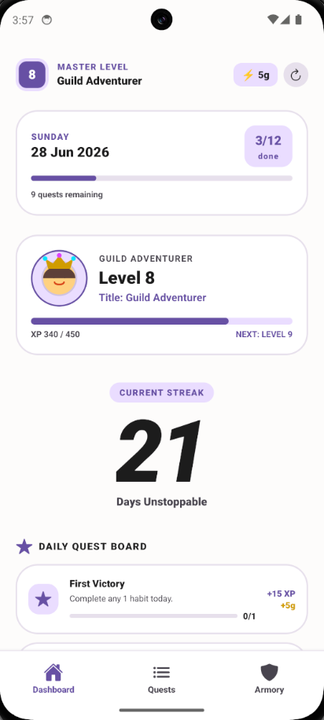
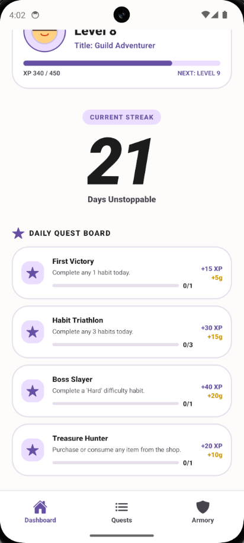
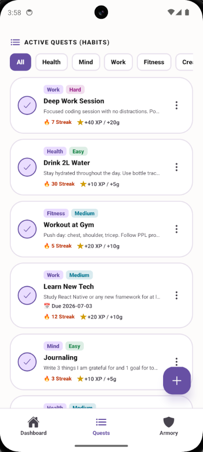
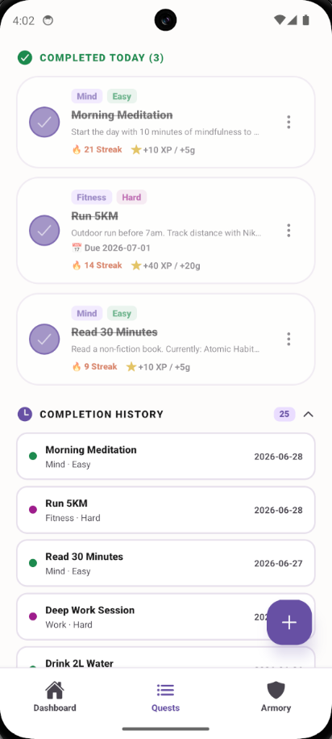
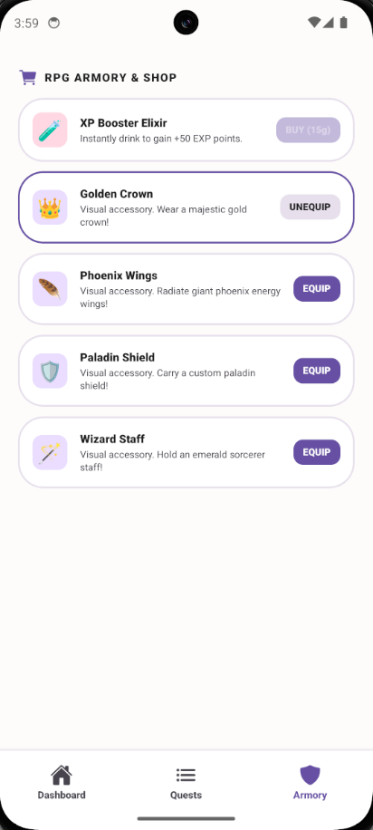

# ⚔️ Habit Tracker — RPG Edition

A habit tracking app with RPG game mechanics. Complete daily habits to earn XP, level up your character, maintain streaks, and unlock items in the shop.

---

## Screenshots

| Dashboard | Daily Quests | Active Quests |
|:---------:|:------------:|:-------------:|
|  |  |  |

| Completed & History | Armory & Shop |
|:-------------------:|:-------------:|
|  |  |

---

## Features

- **Quest System** — Create habits as quests with difficulty levels (Easy / Medium / Hard)
- **RPG Progression** — Earn XP and Gold every time you complete a habit
- **Level & Titles** — Level up your character and unlock new titles
- **Daily Streaks** — Maintain streaks for consecutive daily completions
- **Daily Quests** — Bonus quests that reset every day
- **Completion History** — Persistent log of all completed habits with lazy loading
- **Gold Shop** — Spend gold on XP boosts and avatar cosmetics
- **Edit & Detail View** — Tap any card to view details, edit, or share
- **Due Dates** — Assign due dates to habits

---

## Tech Stack

| | |
|---|---|
| Framework | React Native + Expo SDK 56 |
| Language | TypeScript |
| Styling | NativeWind v4 (Tailwind CSS) |
| Navigation | React Navigation (Bottom Tabs) |
| Database | expo-sqlite (local SQLite) |
| Build | EAS Build (Expo Application Services) |

---

## Project Structure

```
src/
├── components/         # UI components
│   ├── AddHabitModal.tsx
│   ├── CompletionHistorySection.tsx
│   ├── DailyQuestsSection.tsx
│   ├── GoldShopSection.tsx
│   ├── HabitDetailModal.tsx
│   ├── HabitsSection.tsx
│   ├── HeroStreakWidget.tsx
│   ├── PlayerAvatar.tsx
│   ├── PlayerProfileCard.tsx
│   └── TodayProgressCard.tsx
├── context/
│   └── HabitContext.tsx    # Global state management
├── database/               # Repository pattern
│   ├── db.ts               # SQLite connection & schema
│   ├── habitRepo.ts
│   ├── questRepo.ts
│   ├── userStatsRepo.ts
│   ├── completionRepo.ts
│   ├── dateUtils.ts
│   └── types.ts
├── navigation/
│   └── TabNavigator.tsx
├── screens/
│   ├── ArmoryScreen.tsx
│   ├── DashboardScreen.tsx
│   └── QuestsScreen.tsx
└── theme/
    └── colors.ts
```

---

## Getting Started

### Prerequisites

- Node.js 18+
- Expo CLI
- Android Studio (for emulator) or physical Android device

### Install

```bash
npm install
```

### Run

```bash
# Start dev server
npx expo start

# Run on Android emulator
npx expo start --android
```

Scan the QR code with **Expo Go** app on your phone, or press `a` to open on Android emulator.

### Type Check

```bash
npm run typecheck
```

---

## Build APK

This project uses [EAS Build](https://docs.expo.dev/build/introduction/) to generate APKs.

### Setup (first time only)

```bash
npm install -g eas-cli
eas login
```

### Build APK (sideload)

```bash
eas build --platform android --profile preview
```

Download the APK from the link provided after build completes. Install on Android by enabling **"Install from unknown sources"** in settings.

### Build for Play Store

```bash
eas build --platform android --profile production
```

Generates an AAB file ready to upload to Google Play Console.

---

## Database

All data is stored locally on-device using SQLite via `expo-sqlite`. No internet connection required.

| Table | Description |
|-------|-------------|
| `habits` | All habits/quests |
| `user_stats` | XP, level, coins, streak, avatar |
| `daily_quests` | Daily quest progress |
| `habit_completions` | Completion history log |

---

## License

MIT — free to use and modify.
